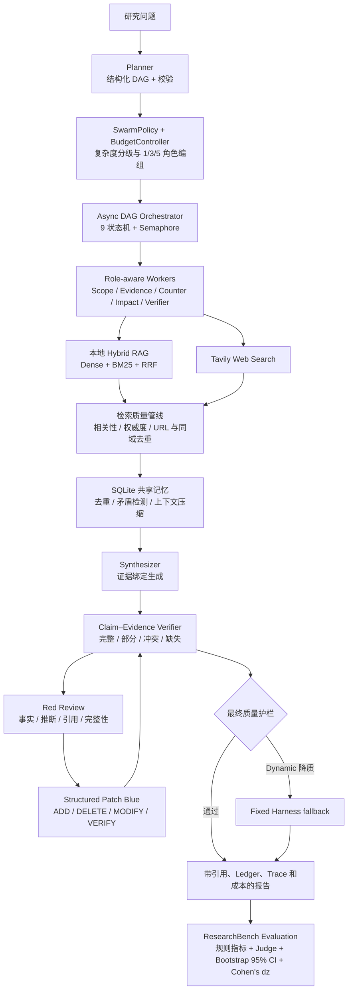

# Deep Research Agent Harness

[](https://github.com/Baoza-cloud/Deep-Research-Agent-Harness/actions/workflows/ci.yml)
[](https://github.com/Baoza-cloud/Deep-Research-Agent-Harness/releases)
[](LICENSE)
[](pyproject.toml)

一个面向复杂研究任务的 Agent Harness：以显式契约编排多角色 Worker，通过 DAG、动态 Swarm、预算控制、共享记忆、Claim–Evidence 验证、Red/Blue 修复和质量门禁生成可追溯报告。检索层可连接 Tavily、论文来源或现有本地 Hybrid RAG，但项目核心是可控、可验证、可评测的 Agent 运行机制，而不是单一 RAG 应用。

## 项目定位

项目以 Harness 为主线，并保留一套可独立使用的本地检索实现：

| 部分 | 解决的问题 | 核心实现 |
|---|---|---|
| Deep Research Harness | 对复杂问题执行多步骤、可审计、受预算约束的深度研究 | DAG Planner、9 状态任务机、Dynamic Swarm、共享记忆、Claim–Evidence Ledger、Red/Blue Patch、质量门禁 |
| 本地 Hybrid RAG | 作为一种可插拔 Retrieval Backend 提供私有文档证据，也可独立运行 | 文档解析、Chunk、Embedding、FAISS、BM25、RRF、相关性过滤、引用输出 |

本地 RAG 没有被推翻。它通过 `LocalHybridSearchBackend` 作为 Harness 的 `retrieval` 工具继续复用；同一运行也可以并行使用 Tavily Web 检索，再通过 RRF 合并本地与 Web 证据。

## 为什么采用 Harness / Swarm

普通 LangChain Agent 通常以“模型选择工具—观察结果—继续调用”的开放循环为中心，适合快速搭建工具调用原型。本项目关注的是可控执行和可验证研究，因此把关键决策显式放到程序层：

| 维度 | 常见 LangChain Agent | 本项目 Harness / Swarm |
|---|---|---|
| 工作流 | 运行时由模型驱动的工具循环 | 先生成并校验 DAG，再按拓扑执行 |
| 生命周期 | 主要关注消息与工具调用 | 9 状态任务机记录完整转换 |
| 并发 | 依赖框架执行器 | `asyncio + Semaphore` 明确控制并发 |
| 角色 | 多为固定角色或固定图 | 按复杂度动态选择 1/3/5 个角色 |
| 预算 | 常以最大步数限制 | 同时约束 Worker、replan、验证查询、评审轮次和时间 |
| 质量控制 | 依赖最终提示词或 Judge | Claim–Evidence 逐句对齐、冲突检测和硬门禁 |
| 修复 | 常整篇重新生成 | `ADD / DELETE / MODIFY / VERIFY` 结构化 Patch，程序确定性应用 |
| 失败处理 | 重试或直接终止 | 单任务降级、批量失败 replan、全局超时强制合成 |
| 可复现性 | Trace 依赖具体框架 | 冻结数据、运行清单、哈希、成对 Bootstrap 和断点续跑 |

Harness 不是另一个 Agent 框架封装，而是一组最小契约：`AgentSpec` 描述角色和能力，`RunContext` 隔离单次运行，`ToolRegistry` 管理工具，`AgentRuntime` 决定本地或远程执行。替换模型、检索后端或 Runtime 时，不需要重写编排和评测。

## 系统架构



可编辑源图位于 [`evaluation/deep_research_architecture.drawio`](evaluation/deep_research_architecture.drawio)。

## 快速开始

### 1. 安装

```bash
git clone https://github.com/Baoza-cloud/Deep-Research-Agent-Harness.git
cd Deep-Research-Agent-Harness
python3 -m pip install -e .
```

如需运行原有本地 Dense + BM25 + RRF 检索：

```bash
python3 -m pip install -e ".[local-rag]"
```

### 2. 配置 DeepSeek 与 Tavily

```bash
cp .env.example .env
```

在 `.env` 中填写：

```dotenv
DEEPSEEK_API_KEY=your_deepseek_key
DEEPSEEK_MODEL=deepseek-v4-flash
DEEPSEEK_BASE_URL=https://api.deepseek.com
TAVILY_API_KEY=your_tavily_key
```

`.env`、SQLite 记忆库和本地索引均被 Git 忽略。也可以使用隐藏输入配置 Tavily：

```bash
python3 evaluation/configure_tavily.py
```

### 3. 一键运行

只验证完整流水线，不调用模型、Web 或本地索引：

```bash
python3 -m research_engine \
  "解释 RAG 的核心流程" \
  --offline \
  --search-provider fixture
```

`fixture` 是固定内置证据，只用于安装检查和 CI，不用于评测研究质量。

使用 DeepSeek 与本地知识库：

```bash
python3 -m research_engine \
  "公司远程办公政策的适用范围、风险和改进建议是什么？" \
  --provider deepseek \
  --model deepseek-v4-flash \
  --search-provider local \
  --output evaluation/research_result.json
```

使用 DeepSeek 与 Tavily：

```bash
python3 -m research_engine \
  "对比 Kubernetes HPA 与 VPA 的适用场景和限制" \
  --provider deepseek \
  --model deepseek-v4-flash \
  --search-provider tavily \
  --web-search-depth advanced \
  --output evaluation/research_result_web.json
```

同时检索本地知识库和 Web：

```bash
python3 -m research_engine "研究问题" \
  --provider deepseek \
  --search-provider hybrid-web \
  --local-weight 1.2 \
  --web-weight 1.0
```

原有本地 RAG 流水线可独立运行：

```bash
PYTHONPATH=src python3 src/rag_pipeline.py
```

`research_engine` 使用包内相对导入。请从仓库根目录执行 `python3 -m research_engine` 或安装后的 `deep-research` 命令，不要直接运行 `src/research_engine/*.py`，否则会出现 `attempted relative import with no known parent package`。

## 两条执行链路

### 本地 Hybrid RAG

```text
企业文档 → 文本清洗与切分 → Embedding / FAISS
                         └→ BM25
Dense 与 BM25 排名 → RRF 融合 → 相关性过滤 → Context → Answer + Sources
```

当没有足够相关的 Chunk 时，流水线返回明确的证据不足结果，不强制生成答案。

### Deep Research Harness

1. Planner 生成结构化研究 DAG，并执行依赖与环检测。
2. SwarmPolicy 根据任务复杂度选择角色、并发和预算。
3. Orchestrator 按拓扑并发执行检索任务，失败时触发三级降级。
4. 检索结果经过相关性、来源权威度、URL、全文和同域近重复过滤。
5. 证据写入 SQLite 共享记忆，并进行去重、矛盾检测和三级上下文压缩。
6. Synthesizer 生成初稿；Verifier 建立逐句 Claim–Evidence Ledger。
7. Red 分类问题，Blue 返回结构化 Patch，由程序确定性修改报告。
8. 最终质量护栏比较 Dynamic 与 Fixed 候选，质量下降时保留更可靠结果。

## 数据集与评测 Track

| 数据集 | 规模 | 用途 | 是否调用实时 Web |
|---|---:|---|---:|
| ResearchBench-Frozen v1.0 | 11 领域 / 35 题 | 冻结证据上的回归、消融和版本比较 | 否 |
| ResearchBench-Adversarial v0.1 | 35 个 Case / 140 个 Gold Fault | Red 检出、Blue 修复、误修和回滚评测 | 否 |
| ResearchBench-Live v1.0 | 15 题，三档复杂度各 5 题 | 真实检索、角色组合和 Web 漂移评测 | 是 |
| Retrieval-Gold v1.0 | 33 条人工复核候选 | 六类角色检索阈值校准 | 使用已缓存候选 |

数据集位于 [`evaluation/datasets/`](evaluation/datasets/)，SHA256 固定在 [`SHA256SUMS`](evaluation/datasets/SHA256SUMS)。Frozen 与 Live 不能混合统计：Frozen 负责可复现比较，Live 负责当前真实检索能力。

## 四组基线与 Blue 消融

| 变体 | Planner / DAG | Red Review | Blue 策略 | 目的 |
|---|---:|---:|---|---|
| `single_agent` | 单任务 | 否 | 无 | 最小单 Agent 基线 |
| `no_red_blue` | 多任务 DAG | 否 | 无 | 测量规划与多任务本身的收益 |
| `rewrite_blue` | 多任务 DAG | 是 | 整篇重写 | 对照自由生成式修复 |
| `structured_patch_blue` | 多任务 DAG | 是 | 结构化 Patch + 验证 + 回滚 | 验证确定性局部修复 |

在此基础上，`fixed_harness` 与 `dynamic_swarm` 使用相同 Structured Patch Blue：前者固定单一 Worker 和预算，后者按复杂度动态选择角色、并发、调用预算和停止条件，用于隔离 SwarmPolicy 的贡献。

运行消融：

```bash
PYTHONPATH=src python3 evaluation/run_ablation_experiments.py \
  --provider deepseek \
  --model deepseek-v4-flash \
  --variants single_agent no_red_blue rewrite_blue structured_patch_blue \
  --repeats 3 \
  --experiment-concurrency 1 \
  --bootstrap-samples 10000
```

## 正式实验结果

### Fixed Harness vs Dynamic Swarm

ResearchBench-Frozen v1.0，35 题 × 3 次，两组共 210 次有效运行：

| 指标 | Fixed Harness | Dynamic Swarm | Dynamic 相对变化 |
|---|---:|---:|---:|
| 综合质量 | 99.68% | 99.55% | -0.13 pp |
| 事实准确率 | 98.40% | 98.07% | -0.33 pp |
| 引用覆盖率 | 100.00% | 100.00% | 持平 |
| Worker 调用/题 | 11.56 | 9.67 | -16.39% |
| LLM 调用/题 | 7.60 | 7.02 | -7.64% |
| 估算 Token/题 | 14,799 | 13,596 | -8.12% |
| 估算成本/题 | $0.009098 | $0.008453 | -7.09% |
| 平均延迟 | 26.15s | 24.72s | -5.45% |

综合质量差异未达显著：Δ=-0.13 pp，95% CI [-0.34, +0.07] pp，paired Cohen's dz=-0.20。Worker 调用降低 16.39%，95% CI 10.39%–22.13%；其余效率指标点估计下降，但区间跨 0，因此不宣称显著改善。

正式产物：

- [统计摘要](evaluation/results/formal_frozen_v1_35x3/ablation-20260922T135223799454Z-summary.md)
- [严格质量门禁](evaluation/results/formal_frozen_v1_35x3/ablation-20260922T135223799454Z-quality-gate.md)
- [冻结与恢复记录](evaluation/results/frozen_release_20260921_v1/formal-run-launch.json)

### Red / Blue 对抗实验

ResearchBench-Adversarial v0.1，35 题 × 3 次：

| 变体 | Red 检出率 | Fault 修复率 | 事实准确率 | 幻觉率 | 引用覆盖率 |
|---|---:|---:|---:|---:|---:|
| Corrupted，无修复 | 99.29% | 0.00% | 24.88% | 75.12% | 50.40% |
| Rewrite Blue | 99.29% | 99.76% | 95.50% | 4.50% | 97.90% |
| Structured Patch Blue | 99.29% | 99.29% | 97.95% | 2.05% | 99.06% |
| Oracle Clean | 99.29% | 100.00% | 100.00% | 0.00% | 100.00% |

安全增强后的 Structured Patch 定向复跑将保守字符串修复率从 86.43% 提升到 99.29%，事实准确率提升到 100%，且干净事实、引用保留率均为 100%。详见[正式四变体报告](evaluation/results/adversarial/adversarial-20260916T031514890111Z.md)与[安全版本前后对照](evaluation/results/adversarial/adversarial-20260916T065323635595Z-vs-adversarial-20260916T024120075281Z.md)。

## 失败恢复与安全机制

- **单任务超时**：`timed_out → degraded`，保留已有证据继续下游任务。
- **批量失败**：达到失败比例阈值后动态 replan，并拒绝冲突或成环节点。
- **全局超时**：取消未完成任务，使用已持久化证据强制合成，状态为 `partial_timeout`。
- **断点续跑**：按 `pair_key` 复用成功样本，校验数据集 SHA、模型、重复次数和 Policy 兼容性。
- **检索安全**：网页正文按不可信数据处理，检测并脱敏指令覆盖、密钥窃取和工具调用型 Prompt Injection。
- **Patch 安全**：拒绝未知 Evidence ID、歧义 target、非法 DELETE、无效替换和超限增长；验证失败自动回滚。
- **Claim 质量门禁**：检测时间、数值、实体冲突；低支持率时定向补证据、降低表述强度或删除陈述。
- **Dynamic 质量护栏**：引用或 Claim 支持率不足时生成 Fixed 候选，比较后保留质量更高者，成本不能覆盖质量下降。

完成状态分为：`completed`、`completed_with_evidence_gaps`、`completed_with_review_issues` 和 `partial_timeout`，避免把诚实的证据缺口与事实错误混为一类。

## 可复现性

参考环境固定为 CPython 3.12.7，版本见 [`.python-version`](.python-version)；CI 的直接与传递依赖固定在 [`requirements.lock`](requirements.lock)。`pyproject.toml` 仍声明项目支持 Python 3.10 及以上，但正式回归以锁定环境为准。

在全新虚拟环境中执行最小可复现流程：

```bash
# 安装与 CI 完全相同的依赖
python3 -m pip install -r requirements.lock
python3 -m pip install --no-deps -e .

# 验证模块入口
python3 -m research_engine --help

# 运行按子系统拆分的 112 项离线测试
python3 -m pytest -q tests

# 零 Key、零网络、零本地索引 smoke test
python3 scripts/offline_smoke.py

# 校验数据集
cd evaluation/datasets && shasum -a 256 -c SHA256SUMS && cd ../..

# 复验正式 35×3 产物
python3 evaluation/validate_formal_ablation.py \
  evaluation/results/formal_frozen_v1_35x3/ablation-20260922T135223799454Z.json \
  --dataset evaluation/datasets/researchbench_frozen_v1.0.json \
  --output-prefix /tmp/researchbench-frozen-v1.0-quality-gate
```

GitHub Actions 配置位于 [`.github/workflows/ci.yml`](.github/workflows/ci.yml)，在 Pull Request、`main` 分支推送和手动触发时执行 Ruff、覆盖率、Python 3.10/3.11/3.12 兼容测试、wheel/sdist 构建、全新环境 wheel 安装、入口检查与离线 smoke。CI 不运行在线检索，避免使用仓库 Secret 和产生调用费用。

在线示例需要用户自行复制 `.env.example` 并填写 DeepSeek 与 Tavily Key：

```bash
cp .env.example .env
python3 -m research_engine \
  "比较 RAG 与长上下文方案的适用边界" \
  --provider deepseek \
  --model deepseek-v4-flash \
  --search-provider tavily \
  --web-search-depth advanced \
  --output evaluation/research_result_web.json
```

该在线命令不会在 CI 中执行；`.env` 已被 Git 忽略。

正式实验固定数据集 SHA、模型、费率、并发、超时、随机重复与 Bootstrap 口径。三次重复先在题内聚合，再以 35 道题作为独立单位进行配对 Bootstrap。

## 项目限制

- Frozen 每题使用单条冻结证据，适合比较编排、修复与成本，不代表开放 Web 的完整召回能力。
- Live 评测会受搜索索引、网页内容和时间变化影响，不能与 Frozen 指标直接合并。
- Retrieval-Gold 来自被过滤候选切片，不是总体检索 Precision/Recall 的无偏估计。
- Token 和美元成本是可审计估算值，不等同于供应商实际账单；正式报告必须注明费率场景。
- OpenAlex 已覆盖真实检索与评测；当前通过统一 Web/Composite 契约接入，跨来源论文版本合并、引用图快照和撤稿状态仍依赖上游元数据。
- 本地 RAG 需要预先构建 FAISS、BM25 数据和可用的 Embedding 模型。

## 项目结构

```text
Deep-Research-Agent-Harness/
├── src/
│   ├── rag_pipeline.py              # 本地 Hybrid RAG
│   ├── hybrid_retrieval.py          # Dense + BM25 + RRF
│   └── research_engine/             # Harness / Swarm / Red-Blue / Memory
├── evaluation/
│   ├── datasets/                    # Frozen / Live / Adversarial / Gold
│   ├── results/                     # 精选正式产物
│   ├── run_ablation_experiments.py
│   └── validate_formal_ablation.py
├── tests/                            # 按 Harness / Retrieval / Verifier 等领域拆分
├── release/v1.1.0/SHA256SUMS         # 正式数据与实验产物哈希
├── docs/DEEP_RESEARCH_AGENT.md
├── .env.example
└── pyproject.toml
```

更详细的实现、阈值校准与评测协议见[技术文档](docs/DEEP_RESEARCH_AGENT.md)。

## 发布与参与

- 当前版本：`v1.1.0`
- [版本记录](CHANGELOG.md)
- [贡献指南](CONTRIBUTING.md)
- [安全策略](SECURITY.md)
- [MIT License](LICENSE)
- [v1.1.0 可复现哈希](release/v1.1.0/SHA256SUMS)
